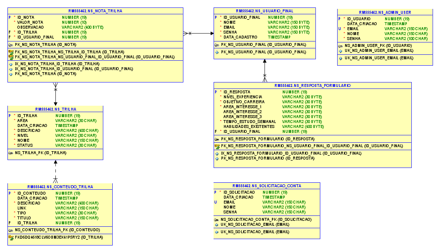
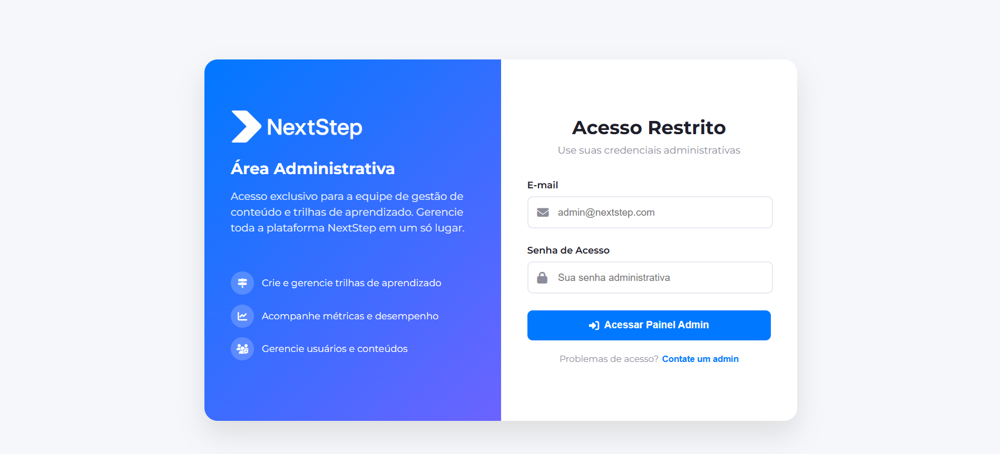
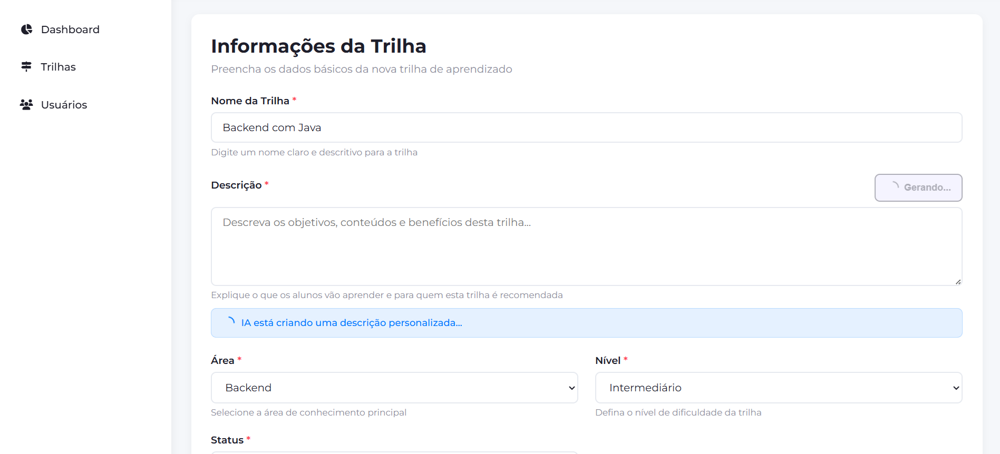

# 🚀 NextStep - Frontend WEB

## 📌 Sumário

- [📝 Descrição da Solução](#-descrição-da-solução)
- [🎥 Vídeo Pitch da Solução](#-vídeo-pitch-da-solução)
- [🧩 Estrutura da Solução](#-estrutura-da-solução)
- [▶️ Como Rodar o Projeto](#️-como-rodar-o-projeto)
- [🖥️ Detalhes do Frontend Web — React.js](#️-detalhes-do-frontend-web--reactjs)
- [🖥️🚀 Como Rodar o Projeto Web (React.js)](#️-como-rodar-o-projeto-web-reactjs)
- [☁️ Deploy da Solução](#️-deploy-da-solução)
- [🎥 Vídeo da API Java em Funcionamento](#-vídeo-da-api-java-em-funcionamento)
- [👥 Integrantes](#-integrantes)

## 📝 Descrição da Solução

O NextStep é uma plataforma inteligente desenvolvida para preparar pessoas para as profissões do futuro, oferecendo trilhas de aprendizado modernas, estruturadas e personalizadas.

Em um mundo onde a tecnologia evolui em ritmo acelerado e as demandas do mercado mudam constantemente, o NextStep surge como uma solução completa para quem deseja se atualizar, se qualificar e avançar na carreira com segurança.

A plataforma possui **duas frentes principais**:
- 🌐 **Painel Web Administrativo** — onde gestores criam e organizam trilhas de estudo;

- 📱 **Aplicativo Mobile** — onde os usuários consomem conteúdos, acompanham seu progresso e recebem recomendações personalizadas.

As trilhas são criadas em áreas essenciais como **Backend, Frontend, Cloud, Dados e Inteligência Artificial**, podendo incluir cursos, artigos, vídeos, podcasts, desafios práticos e outros recursos externos.
Para agilizar o processo, o admin conta com uma **IA integrada**, capaz de gerar automaticamente descrições completas de trilhas a partir apenas do título informado.

No app, o usuário tem uma jornada clara, simples e guiada. Com ajuda da **IA recomendadora**, o NextStep analisa o perfil, interesses e objetivos do usuário por meio de um pequeno questionário e indica automaticamente a trilha mais adequada, tornando o processo de aprendizado muito mais assertivo.

---

## 🎥 Vídeo Pitch da Solução

Para entender a visão geral do **NextStep**, sua proposta, funcionalidades principais e o problema que a solução resolve, assista ao vídeo pitch preparado especialmente para apresentar o projeto de forma clara e objetiva.

**👉 Assista ao Vídeo Pitch aqui:**

[Clique para ver o vídeo pitch do NextStep](https://www.youtube.com/watch?v=hw-RtEkYCA4)

Este vídeo resume:

- O propósito da plataforma
- Como o NextStep ajuda na preparação para profissões do futuro
- Os diferenciais da solução
- Demonstrações visuais das principais telas
- A importância de cada módulo desenvolvido

> É a melhor forma de ter uma visão rápida, completa e direta sobre todo o ecossistema NextStep.

---

## 🧩 Estrutura da Solução

O **NextStep** foi desenvolvido com uma arquitetura moderna, modular e escalável, dividida em múltiplos serviços que se integram para entregar uma experiência fluida tanto para administradores quanto para usuários finais.

### ☕ Backend Administrativo — Java + Spring Boot

Responsável por toda a **lógica administrativa** da plataforma.

- CRUD de **trilhas** e **conteúdos** (cursos, artigos, desafios, etc.).
- Geração automática de descrições utilizando **IA integrada**.
- Exposição de APIs REST para o **painel web**.
- Integração direta com o **banco Oracle**.

[🔗 Repositório de Backend Java](https://github.com/felipesora/nextstep-backend-java)

### 🌐 Painel Web Administrativo — React.js

- Interface utilizada pelos **gestores** para criar e **gerenciar trilhas**.

- Desenvolvido em **React.js**.

- Consome exclusivamente a **API Java com Spring Boot**.

- Interface **moderna e responsiva**, focada em **produtividade**.

[🔗 Repositório do Frontend WEB](https://github.com/felipesora/nextstep-frontend-web)

### ⚙️ API do Usuário Final — .NET + ASP.NET Core

Camada que **atende o aplicativo mobile**.

- **Mapeia e expõe as tabelas de trilhas e conteúdos** criadas pelo backend Java.

- Responsável por **cadastro/login**, **progresso do usuário e consumo das trilhas**.

- Estruturada com **ASP.NET Core MVC + Entity Framework**.

- Focada em **alta performance e segurança**.

[🔗 Repositório de Backend .NET](https://github.com/felipesora/nextstep-backend-dotnet)

### 📱 Aplicativo Mobile — React Native + Expo

Aplicação voltada aos **usuários que irão consumir as trilhas**.

- Desenvolvido com **React Native + Expo**.

- Interface clara, intuitiva e otimizada para estudo.

- Consome a **API .NET**.

- Possui **IA recomendadora que sugere a trilha ideal com base no perfil do usuário**.

[🔗 Repositório do Mobile](https://github.com/felipesora/nextstep-frontend-mobile)

### 🗄️ Banco de Dados — Oracle

Armazena **todas as informações da plataforma**:

- Tabelas de **trilhas, conteúdos, usuários, progresso, notas e estatísticas**.

- Estrutura centralizada garantindo **consistência entre Java e .NET**.

[🔗 Repositório do Banco de Dados]()

### ☁️ Deploy & Infraestrutura — Azure

A API Java (admin) é publicada utilizando **práticas modernas de DevOps**:

- **Pipelines de CI/CD** no Azure DevOps.

- **Build automatizado**, execução de testes (quando houver) e **deploy contínuo**.

- Infraestrutura **escalável e segura**.

[🔗 Repositório de Cloud](https://github.com/felipesora/nextstep-cloud)

---

## 🗄️ Modelagem do Banco de Dados

Abaixo está a modelagem das tabelas utilizadas pelo sistema:



---

## ▶️ Como Rodar o Projeto

Para executar o NextStep localmente, siga a ordem correta dos serviços, garantindo que cada camada esteja funcionando antes de iniciar a próxima.

Abaixo está o fluxo recomendado:

### 1️⃣ Rodar a API Administrativa — Java + Spring Boot

1. Certifique-se de ter o **Java 21+** instalado.

2. Configure a conexão com o banco Oracle no application.properties.

3. Inicie o projeto Spring Boot.

4. Aguarde a criação/mapeamento inicial das tabelas necessárias.

> 💡 **Importante:** É essa API que fornece todos os dados administrativos e cria as trilhas e conteúdos utilizados por todo o ecossistema.

### 2️⃣ Rodar o Painel Web Administrativo — React.js

1. Instale dependências com `npm install`.

2. Configure as variáveis de API em cada service, com a url da api `Java`

3. Rode com `npm run dev`.

4. Acesse o painel e **cadastre algumas trilhas e conteúdos** — isso é essencial para que o app mobile e a API .NET tenham dados para consumir.

### 3️⃣ Rodar a API do Usuário Final — .NET + ASP.NET Core

1. Instale o .NET 8+.

2. Configure a connection string do Oracle.

3. Inicie o projeto (`dotnet run`).

4. Essa API irá consumir as tabelas geradas pelo backend Java e disponibilizar os dados para o app mobile.

### 4️⃣ Rodar o Aplicativo Mobile — React Native + Expo

1. Instale dependências com `npm install`.

2. Configure as variáveis de API em cada service, com a url da api de `.NET`.

3. Rode com `npx expo start`.

4. Abra no celular ou emulador para testar a jornada do usuário final.

### 📌 Observação Importante

Cada parte do NextStep possui **seu próprio repositório e um README separado**, com **todas as instruções detalhadas** de instalação, configuração e execução.

Esta seção é apenas um **guia geral**, mostrando a ordem correta de execução dos componentes.

## 🖥️ Detalhes do Frontend Web — React.js

O painel administrativo do NextStep foi desenvolvido em **React.js**, oferecendo uma interface moderna, intuitiva e responsiva para que administradores possam gerenciar trilhas, conteúdos e utilizar ferramentas de IA com facilidade.

Ele consome diretamente a **API Java (Spring Boot)** hospedada no Render, permitindo o cadastro, edição e visualização das trilhas de estudo.

### 📸 Prints do Painel Administrativo

A seguir, algumas telas representativas do painel web:

**🔐 Tela de Login**


**🏠 Dashboard Administrativo**


**📚 Listagem de Trilhas**


**🗃️ Conteúdos de uma trilha**


**🤖 Geração de Descrição com IA**


---

## 🖥️🚀 Como Rodar o Projeto Web (React.js)

Para executar o **NextStep Web (Painel Administrativo)** em ambiente local, siga os passos abaixo:

### 1️⃣ Instalar Dependências
No diretório do projeto, execute:

```bash
npm install
```
Isso instalará todas as dependências necessárias para rodar o painel web.

### 2️⃣ Configurar a URL da API (Opcional, mas recomendado)
Por padrão, o projeto web está configurado para consumir a **API Java hospedada no Render** — que pode demorar alguns segundos para responder.

Se preferir usar a **API rodando localmente**, basta alterar a constante `API` para:

```javascript
const API = "http://localhost:8080";
```

Essa constante aparece nos arquivos de services, como por exemplo:

```bash
src/services/TrilhaService.js  
src/services/AuthService.js  
src/services/ConteudoService.js  
...
```

> Certifique-se de substituir em **todos** os arquivos que utilizam a URL da API.

### 3️⃣ Executar o Projeto
Após instalar as dependências, execute o comando:

```bash
npm run dev
```
Isso iniciará o servidor de desenvolvimento.

### 4️⃣ Acessar o Painel Web
Abra o navegador e acesse: 

[👉 http://localhost:5173](http://localhost:5173)

O painel estará disponível e pronto para consumir a API local ou a API hospedada, dependendo da configuração feita no passo anterior.

> ⚠️ Dica: Usar a API Java localmente costuma ser muito mais rápido durante o desenvolvimento, evitando o atraso inicial do Render.

---

## ☁️ Deploy da Solução

A solução NextStep possui deploy para o **backend administrativo (Java + Spring Boot) e para o painel web administrativo (React.js)**. Ambos estão publicados e integrados entre si.

### 🔸 **API Administrativa — Java (Spring Boot)**

A API Java está hospedada no Render, e pode ser acessada pela URL:

**👉 API Java (Deploy)**:
[https://nextstep-backend-java.onrender.com](https://nextstep-backend-java.onrender.com)

>⚠️ **Importante**: Como a API está hospedada no Render, ela pode levar alguns segundos para acordar ao ser acessada pela primeira vez após ficar inativa. Por isso, ao abrir o painel web, aguarde a API inicializar caso as chamadas retornem erro no primeiro momento.

### 🔸 Painel Web Administrativo — React.js

O painel web está devidamente publicado e configurado para consumir a API Java no deploy.

**👉 URL do Painel Web**:
[https://nextstep-frontend-web.vercel.app/](https://nextstep-frontend-web.vercel.app/)

Este front-end já está apontando para a URL pública da API Java, permitindo:

- Login com o usuário administrador padrão
- Criação de trilhas, conteúdos, recursos e categorias

>Lembre-se: se ao abrir o painel ocorrer erro de carregamento, provavelmente a API ainda está inicializando no Render. Basta aguardar alguns segundos e recarregar a página.

---

## 🎥 Vídeo da API Java em Funcionamento

Para demonstrar o funcionamento da API administrativa desenvolvida em **Java + Spring Boot**, disponibilizei um vídeo completo mostrando:

- O processo de autenticação
- A criação de trilhas e conteúdos
- O funcionamento dos endpoints
- A integração com IA via Spring AI Ollama
- A estrutura geral da aplicação no painel administrativo

👉 **Assista ao vídeo aqui**:
[Clique para ver o vídeo da API Java / WEB](https://www.youtube.com/watch?v=eaWrRpiMwb0)

---

## 👥 Integrantes

- **Felipe Ulson Sora** – RM555462 – [@felipesora](https://github.com/felipesora)
- **Augusto Lopes Lyra** – RM558209 – [@lopeslyra10](https://github.com/lopeslyra10)
- **Vinicius Ribeiro Nery Costa** – RM559165 – [@ViniciusRibeiroNery](https://github.com/ViniciusRibeiroNery)